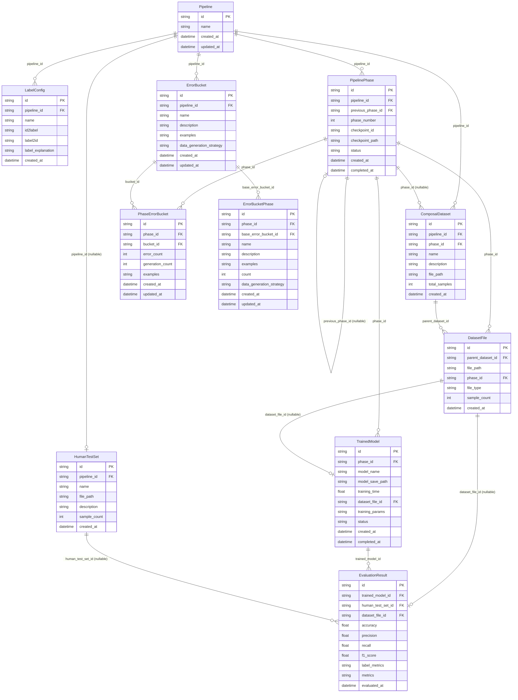
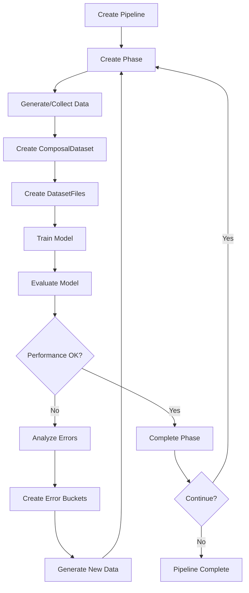

# Database Schema and Relationships

This document provides a visual representation of the database schema and the relationships between tables.

## Entity Relationship Diagram



## Table Descriptions

### Core Pipeline Tables

#### Pipeline
The root entity representing a training pipeline. Each pipeline has its own label configuration and manages multiple phases of training.

#### LabelConfig
Stores the label configuration for a pipeline, including mappings between label IDs and names, and optional explanations for each label.

#### PipelinePhase
Represents a single phase in the training pipeline. Phases are linked sequentially through `previous_phase_id`, allowing tracking of the pipeline's progression. Each phase has a status (pending, in_progress, completed, failed).

### Dataset Management Tables

#### ComposalDataset
A collection of dataset files that together form a complete dataset for training. Each composal dataset is associated with:
- A pipeline (via `pipeline_id`)
- A phase that generated it (via `phase_id`)
- Multiple dataset files (via `DatasetFile.parent_dataset_id`)

#### DatasetFile
Individual dataset files that belong to a composal dataset. Each file is associated with:
- A parent composal dataset
- The phase that created it
- A file type (train, validation, test, generated)

### Error Analysis Tables

#### ErrorBucket
Base error buckets that categorize types of model errors. These are defined at the pipeline level and contain:
- A descriptive name
- Example samples
- Data generation strategies for addressing the errors

#### PhaseErrorBucket
Tracks specific error instances for each phase, linking error buckets to phases with:
- Error counts
- Generation counts (how many samples were generated to address this error)
- Phase-specific examples

#### ErrorBucketPhase
A cloned version of error buckets for specific phases, allowing phase-specific error categorization with independent examples and counts.

### Model Training & Evaluation Tables

#### TrainedModel
Records information about trained models, including:
- The phase that produced the model
- Training parameters and duration
- Model checkpoint path
- Training status

#### EvaluationResult
Stores evaluation metrics for trained models, including:
- Standard metrics (accuracy, precision, recall, F1)
- Per-label metrics (stored as JSON)
- References to the model, dataset, and optionally a human test set

#### HumanTestSet
Custom human-curated test datasets that can be optionally associated with a pipeline for evaluation purposes.

## Key Relationships

### 1. Pipeline → Phases (One-to-Many)
A pipeline progresses through multiple phases, each representing a training iteration.

### 2. Phase → Phase (Self-Reference)
Phases are linked sequentially via `previous_phase_id`, forming a chain that represents the pipeline's history.

### 3. Phase → ComposalDataset (One-to-Many)
Each phase can generate multiple composal datasets (though typically one per phase for first-gen API calls).

### 4. ComposalDataset → DatasetFile (One-to-Many)
A composal dataset aggregates multiple dataset files (e.g., train, validation, test splits).

### 5. Phase → DatasetFile (One-to-Many)
Each dataset file is created during a specific phase, allowing tracking of when data was generated.

### 6. Phase → TrainedModel (One-to-Many)
A phase can produce multiple trained models (though typically one).

### 7. DatasetFile → TrainedModel (Many-to-One, Optional)
A trained model may reference the specific dataset file used for training.

### 8. TrainedModel → EvaluationResult (One-to-Many)
A single model can have multiple evaluation results (evaluated on different datasets or test sets).

### 9. ErrorBucket → PhaseErrorBucket (One-to-Many)
Base error buckets are instantiated for each phase to track phase-specific error metrics.

## Data Flow



## Phase Lifecycle

Each phase goes through the following states:

1. **pending**: Phase created but not started
2. **in_progress**: Phase is actively running (training, evaluation, etc.)
3. **completed**: Phase finished successfully
4. **failed**: Phase encountered an error

## Important Notes

### Phase ID in ComposalDataset
The `phase_id` field in `ComposalDataset` was added to track which phase generated each composal dataset. This is crucial for the first-gen API workflow where:
- Each API call creates a new phase
- Each phase generates a composal dataset
- Only operations like "evaluation" or "train" produce different results per phase

### JSON String Fields
Several fields store JSON data as strings due to SQLite limitations:
- `LabelConfig`: `id2label`, `label2id`, `label_explanation`
- `ErrorBucket`, `PhaseErrorBucket`: `examples`
- `TrainedModel`: `training_params`
- `EvaluationResult`: `label_metrics`, `metrics`

These should be parsed when retrieved and serialized when stored.

### Cascade Delete Behavior
Most relationships use `ON DELETE CASCADE`, meaning:
- Deleting a pipeline will delete all its phases, datasets, and error buckets
- Deleting a phase will delete its dataset files and trained models
- Deleting a composal dataset will delete its dataset files

### Optional Relationships
- `HumanTestSet.pipeline_id` is optional - test sets can exist independently
- `PipelinePhase.previous_phase_id` is null for the first phase
- `ComposalDataset.phase_id` is optional for backward compatibility

## Indexing Strategy

The following indexes are created for performance:

```sql
-- Foreign key indexes
idx_label_config_pipeline ON label_config(pipeline_id)
idx_pipeline_phase_pipeline ON pipeline_phase(pipeline_id)
idx_composal_dataset_pipeline ON composal_dataset(pipeline_id)
idx_composal_dataset_phase ON composal_dataset(phase_id)
idx_dataset_file_parent ON dataset_file(parent_dataset_id)
idx_dataset_file_phase ON dataset_file(phase_id)
idx_error_bucket_pipeline ON error_bucket(pipeline_id)
idx_phase_error_bucket_phase ON phase_error_bucket(phase_id)
idx_phase_error_bucket_bucket ON phase_error_bucket(bucket_id)
```

These indexes optimize:
- Lookups by foreign key relationships
- Queries filtering by pipeline or phase
- Joins between related tables
